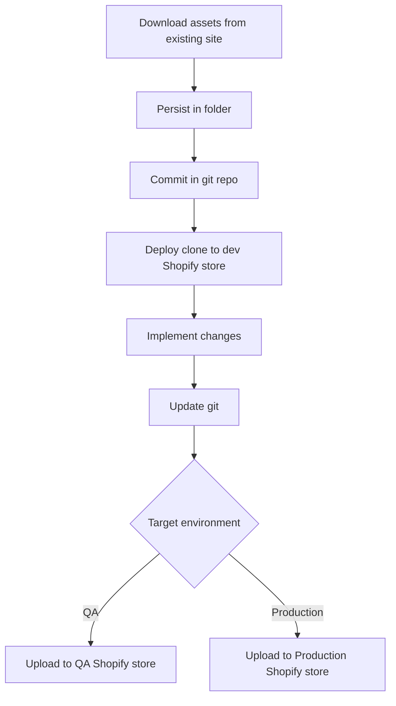

# Shopify Admin CLI

A comprehensive command-line interface for Shopify store management that extends beyond the limitations of the official Shopify CLI.

## Purpose

This CLI tool is designed to provide complete asset management capabilities for Shopify stores to implement GitOps

## Objectives

### Complete Asset Download

- Download **all store assets**, not just theme files
- Access and retrieve assets across all Shopify Admin API endpoints
- Provide comprehensive store backup capabilities

### GitHub Integration

- Store downloaded assets in organized target folders
- Enable seamless integration with GitHub repositories
- Support version control workflows for Shopify development
- Maintain proper file structure for collaborative development

### Enhanced Development Workflow



## Use Cases

- Complete store backups and migrations
- Multi-environment development workflows
- Restrict access to dev environment for 3rd party developers
- Offline development and testing scenarios

## Development Setup

```bash
git clone https://github.com/vkhazin-befitnow/shopify-admin-cli.git
cd shopify-admin-cli
npm install
npm run build
npm link
```

### Prerequisites

#### 1. Create Shopify Partner Account and App

1. Go to [Shopify Partners](https://partners.shopify.com/)
2. Create a partner account if you don't have one
3. In your Partner Dashboard, click "Apps" → "Create app"
4. Choose "Create app manually"
5. Fill in app details:
   - **App name**: Your CLI app name
   - **App URL**: `http://localhost:9000`
   - **Allowed redirection URL(s)**: `http://localhost:9000/callback`
6. After creating the app, you'll see your credentials in the app settings

#### 2. Configure Environment Variables

From your Shopify Partner app settings, copy the credentials and set:

```bash
export SHOPIFY_CLIENT_ID="your-actual-client-id-from-partner-dashboard"
export SHOPIFY_CLIENT_SECRET="your-actual-client-secret-from-partner-dashboard"
```

Or create a `.env` file in the project root:

```
SHOPIFY_CLIENT_ID=your-actual-client-id-from-partner-dashboard
SHOPIFY_CLIENT_SECRET=your-actual-client-secret-from-partner-dashboard
```

### Development Mode

```bash
npm run dev [command]
```
