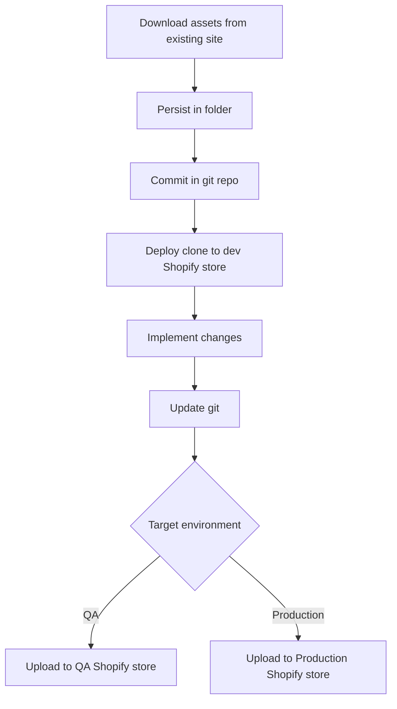

# Shopify Admin CLI

A comprehensive command-line interface for Shopify store management that extends beyond the limitations of the official Shopify CLI.

## Purpose

This CLI tool is designed to provide complete asset management capabilities for Shopify stores to implement GitOps

## Objectives

### Complete Asset Download

- Download **all store assets**, not just theme files
- Access and retrieve assets across all Shopify Admin API endpoints
- Provide comprehensive store backup capabilities

### GitHub Integration

- Store downloaded assets in organized target folders
- Enable seamless integration with GitHub repositories
- Support version control workflows for Shopify development
- Maintain proper file structure for collaborative development

### Enhanced Development Workflow

## Use Cases

- Complete store backups and migrations
- Multi-environment development workflows
- Restrict access to dev environment for 3rd party developers
- Offline development and testing scenarios
